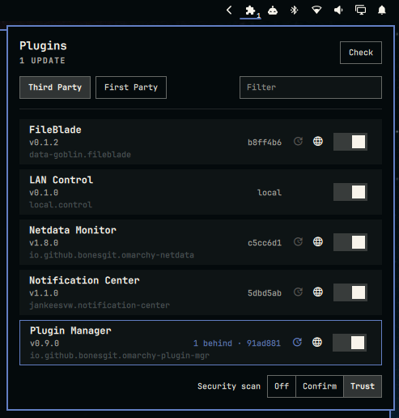

# Plugin Manager

Omarchy bar widget that lists shell plugins in **Third Party** and **First Party**
tabs, with enable/disable, git update checks, update, remove, and a button that
opens the repo.

Plugin id: `io.github.bonesgit.omarchy-plugin-mgr`



## What it shows

**Third Party** is anything under `~/.config/omarchy/plugins/` that is not
`omarchy.*`. **First Party** is the stock `omarchy.*` set.

Each row:

- name, id, version
- enabled / disabled
- git vs local-only (third-party)
- commits ahead of origin after a check (third-party)

Filter box next to the tabs matches name or id on both tabs.

First-party rows can be enabled or disabled. They cannot be removed or git-updated.

## Actions

- **Enable / disable** — `omarchy plugin enable|disable`
- **Check** — `git fetch origin HEAD` then `rev-list HEAD..FETCH_HEAD` (same
  comparison `omarchy plugin update` uses)
- **Update** — `omarchy plugin update <id> --yes`
- **Remove** — right-click a row to arm it (urgent border, 4s), then left-click **Remove**
- **Repo** — `xdg-open` the origin URL (or `repository` / `homepage` in the
  manifest)

Periodic checks default to every 24 hours (bar setting `checkHours`), counted
from the last check stored in `~/.local/state/omarchy/plugin-mgr/last-check.json`.
Shell start and plugin load do not fetch remotes. Right-click the pill, **Check**
in the panel, or `r` in the panel, runs a check now.

## Install

```bash
omarchy plugin add https://github.com/BonesGit/omarchy-plugin-mgr.git --enable
```

## Update

```bash
omarchy plugin update io.github.bonesgit.omarchy-plugin-mgr
```
Or update itself in the plugin panel.

## Remove

```bash
omarchy plugin remove io.github.bonesgit.omarchy-plugin-mgr
```

Helper for the terminal:

```bash
~/.config/omarchy/plugins/io.github.bonesgit.omarchy-plugin-mgr/bin/plugin-mgr list
~/.config/omarchy/plugins/io.github.bonesgit.omarchy-plugin-mgr/bin/plugin-mgr check
```
